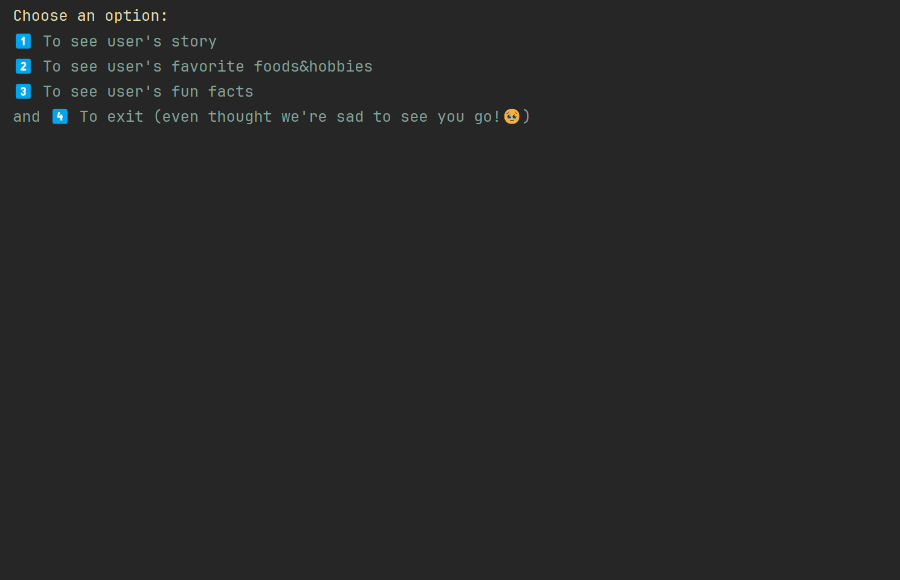

# ⭐ DAM - Exercise 3

### Objective 🎯
---
Creating a social app prototype.
It shows your favorite foods, hobbies, some fun facts, your story and username.

### How does the app work ⚙️
---
1. A menu will display.
2. You must choose one of the following options:
   
| Option | Description |
| ----------- | ----------- |
| 1 | Displays the user personal story. |
| 2 | Displays the user favorite foods and hobbies. |
| 3 | Displays the user chosen fun facts. |
| 4 | Exits the program. |

### Demo GIF 📹
---

